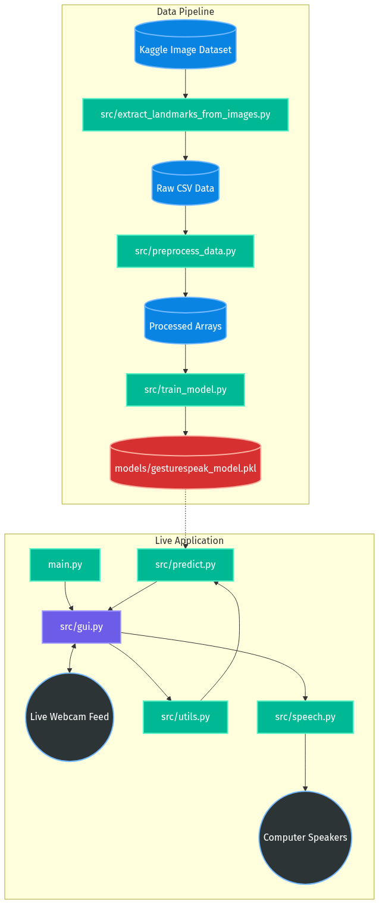
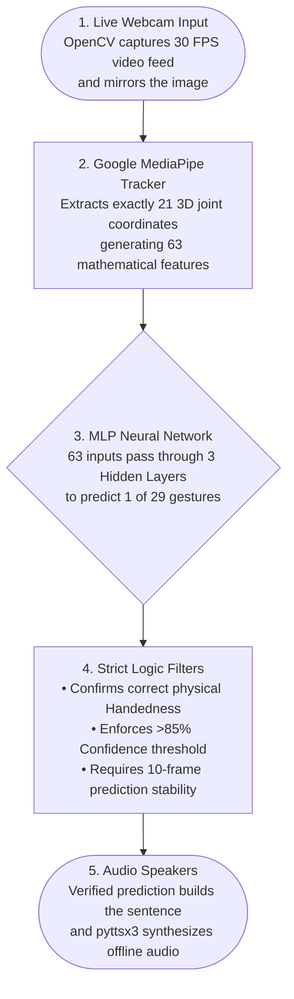
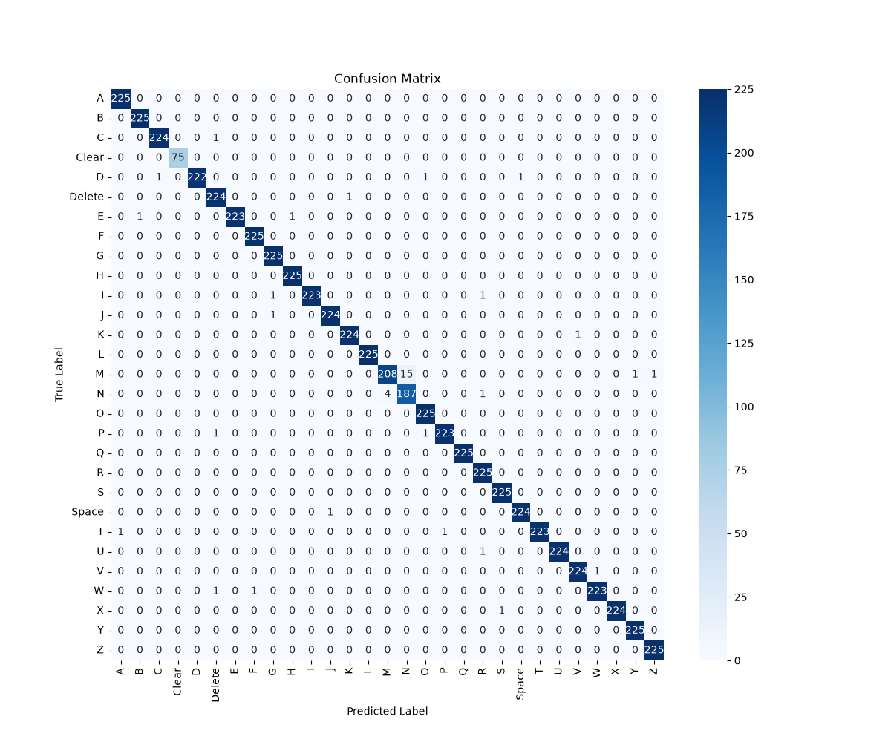
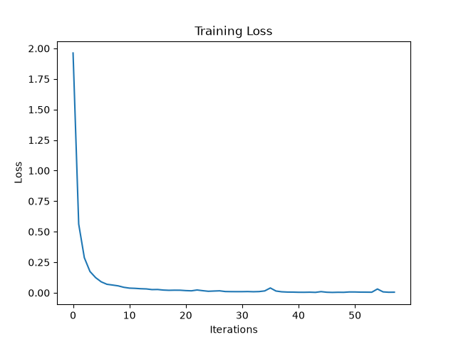

# GestureSpeak AI 🤖🤟

[](https://www.python.org/)
[](https://developers.google.com/mediapipe)
[](https://scikit-learn.org/)
[](https://opensource.org/licenses/MIT)

**GestureSpeak AI** is a Real-time American Sign Language (ASL) Recognition System built for assisting communication between deaf or mute individuals and non-sign-language users. 

This project utilizes **Google MediaPipe** for robust 3D hand tracking and a high-performance **Deep Neural Network (MLP)** for real-time classification, achieving a staggering **99.76% testing accuracy**.

---

## 🌟 Key Features
- **Real-Time Detection:** Live webcam inference processing 3D hand landmarks instantly at 30+ FPS.
- **Full ASL Alphabet (A-Z):** Supports all 26 English letters.
- **Intelligent Text Generation:** Includes smart debouncing, stability tracking, and cooldown algorithms to prevent duplicate letter spamming, ensuring clean sentence construction.
- **Special Commands:** Built-in gestures for `SPACE`, `DELETE`, and `CLEAR` to give users full control over their sentences.
- **Text-to-Speech (TTS):** Integrated offline voice synthesis (`pyttsx3`) to speak the generated sentences out loud at the click of a button.
- **High Accuracy Filtering:** Enforces a strict >85% confidence threshold to ignore blurry or uncertain frames.

---

## 🎮 How to Use (Strict Handedness)
To prevent accidental typing while doing commands, the AI is programmed to strictly enforce which physical hand you use:
- 🖐️ **Left Hand:** Use your physical left hand exclusively for spelling the **Alphabet (A-Z)**.
- ✋ **Right Hand:** Use your physical right hand exclusively for **Special Commands** (Space, Delete, Clear).

*Note: If you use the wrong hand, the UI will actively warn you to switch hands and reject the prediction.*

---

## 🛠️ Technology Stack & Hardware
- **Python 3.12**
- **OpenCV:** Real-time webcam capture and image processing.
- **Google MediaPipe:** Extraction of 21 3D hand landmarks (63 total features).
- **Scikit-Learn (MLPClassifier):** Deep learning model for gesture classification.
- **CustomTkinter:** Modern, responsive Graphical User Interface (GUI).
- **pyttsx3:** Offline Text-to-Speech engine.
- **Pandas & NumPy:** Data preprocessing and CSV manipulation.

### Hardware Requirements
Because we engineered a custom Multi-Layer Perceptron (MLP) that trains on mathematical 3D skeleton data rather than raw image pixels (CNN), **this project does NOT require a dedicated GPU.** It will run blazingly fast in real-time on any standard laptop CPU!

---

## 🚀 How to Run
1. Install dependencies:
```bash
pip install -r requirements.txt
```

2. Launch the Application:
```bash
python main.py
```

---

## 🏗️ System Architecture & Workflow

### Overall Architecture
The system is divided into a Training Pipeline (which processed 87,000 real images into a 63-feature CSV array) and a Live Inference pipeline (which predicts gestures in real-time).
<br>
<p align="center">
  
</p>

### Live Inference Workflow
This is the strict filtration logic that runs 30 times a second. It prevents the model from rapidly spamming glitches onto the screen by enforcing a triple-check: **Handedness ➔ Confidence ➔ 10-Frame Stability**.



---

## 📈 Performance Metrics (99.76% Accuracy)
The Neural Network was trained on the maximum capacity of **87,000 real-world 3D hand poses**. Because it was exposed to tens of thousands of varied lighting conditions and angles, it achieves near-perfect precision on unseen data.

- **Total Classes:** 29 (A-Z, Space, Delete, Clear)
- **Total Dataset:** 87,000 Physical Images
- **Final Test Accuracy:** **`99.76%`**

#### Confusion Matrix & Training Loss Curve
<p align="center">
  
  &nbsp; &nbsp;
  
</p>
